# DevOps Practices Applied in a Spring Boot Web Application Project Overview:

In this project, I developed a Spring Boot backend application and gradually extended it by applying different 
DevOps practices such as version control, continuous integration, automation scripts, deployment simulation, 
and basic monitoring. The main focus of the project was not only to build a working web application but also to 
demonstrate how modern software development workflows can be organized using DevOps principles in a structured and 
repeatable way. The application itself is built using Java and Spring Boot framework. I followed a layered architecture 
approach where each part of the system has a clear responsibility. The controller layer is responsible for handling 
HTTP requests, the service layer contains the core business logic of the application, and the repository layer is 
responsible for interacting with the database. This structure helps to keep the project clean, organized, and 
easier to maintain.
During development, I also used Git as a version control system and maintained two separate branches: main and dev. 
The main branch represents the stable version of the application, while the dev branch was used for active development 
and testing new changes before merging them into the main branch.

# Technologies Used:
In this project, I used the following technologies and tools: Java 17 as the programming language, Spring Boot 
as the backend framework, Spring Data JPA for database communication, H2 in-memory database for testing and simplicity,
Maven for project build and dependency management, Git and GitHub for version control, GitHub Actions for continuous 
integration, Bash scripting for automation and deployment simulation and Swagger UI for API documentation and testing.
Each of these tools was chosen to demonstrate a different part of the software development lifecycle and 
DevOps workflow.

# Project Structure:

The project follows a layered architecture design:
   1. Controller Layer: Handles incoming HTTP requests and maps them to service methods. 
   2. Service Layer: Contains the business logic and processes data.
   3. Repository Layer: Communicates with the database and performs CRUD operations.
   4. Entity Layer: Represents database tables as Java objects.
   5. DTO Layer: Transfers data between client and server without exposing internal structure.
so that it separates responsibilities and ensures that the application remains scalable and easy to maintain.

# How to Run the Project Locally

the repository must first be cloned from GitHub: git clone https://github.com/anaBalukha/devopsM.git
                                                 cd devopsM

After cloning the repository, I open the project in IntelliJ IDEA and make sure Maven dependencies are loaded correctly.
as I mentioned before the project contains two Git branches:
             main branch → stable version of the application
             dev branch → development version

To switch to the development branch,use: git checkout dev
To run the application, execute: mvn spring-boot:run

After running the application successfully, it becomes available at: http://localhost:8080

Swagger API documentation can be accessed at: http://localhost:8080/swagger-ui/index.html

# Continuous Integration (GitHub Actions)

I implemented Continuous Integration using GitHub Actions. The main purpose of CI is to automatically build and 
test the application whenever changes are pushed to the repository. The pipeline is triggered automatically 
on every push or pull request to the main or dev branches. This ensures that the code is always in a working state 
and helps detect errors early during development.
The CI pipeline performs the following steps: 
             1. It checks out the repository code
             2. It sets up Java environment
             3. It builds the project using Maven
             4. It runs all unit tests to ensure correctness

# Infrastructure as Code (IaC) & Automation
I created Bash scripts that automate the setup and execution of the project. 
These scripts simulate environment preparation and deployment processes.
The main purpose of these scripts is to demonstrate how infrastructure tasks can be automated instead 
of being done manually. The scripts include:
                                  1. setup.sh → prepares environment and builds project
                                  2. blue.sh → simulates blue deployment
                                  3. green.sh → simulates green deployment
                                  4. rollback.sh → restores previous stable version
These scripts can be executed using a single command in terminal and they automate repetitive tasks 
such as building and running the application.

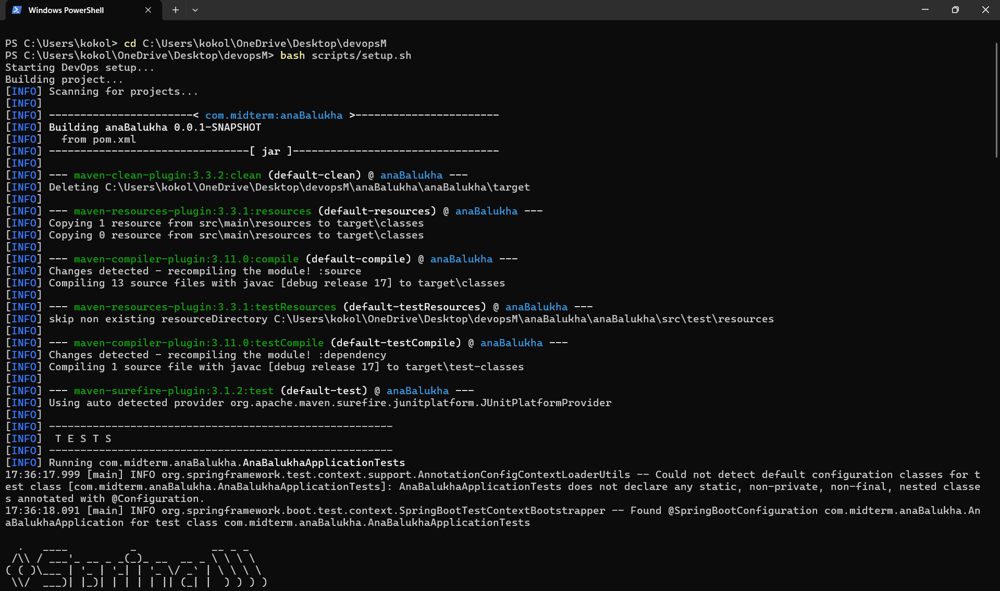
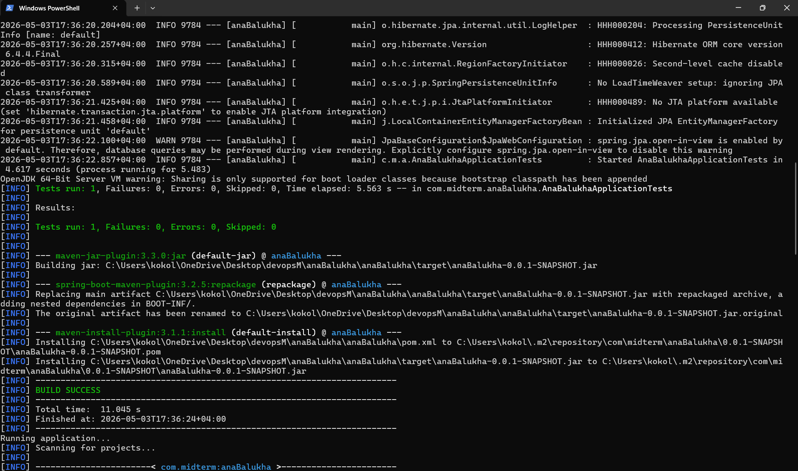
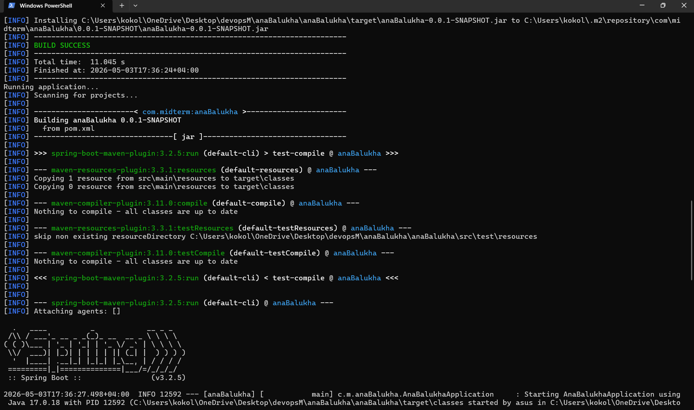
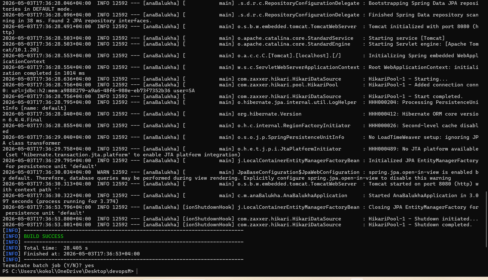

# Continuous Deployment (Blue-Green Deployment)

I implemented a Blue-Green deployment simulation to demonstrate how modern applications can be updated 
without downtime. In this approach, two versions of the application exist:
      1. Blue environment → current stable version
      2. Green environment → new version being tested or deployed
and by switching between these environments, I simulate how updates can be deployed safely without 
stopping the application.
Additionally, I implemented a rollback script which allows reverting back to a previous stable version 
in case of failure or unexpected behavior happens.

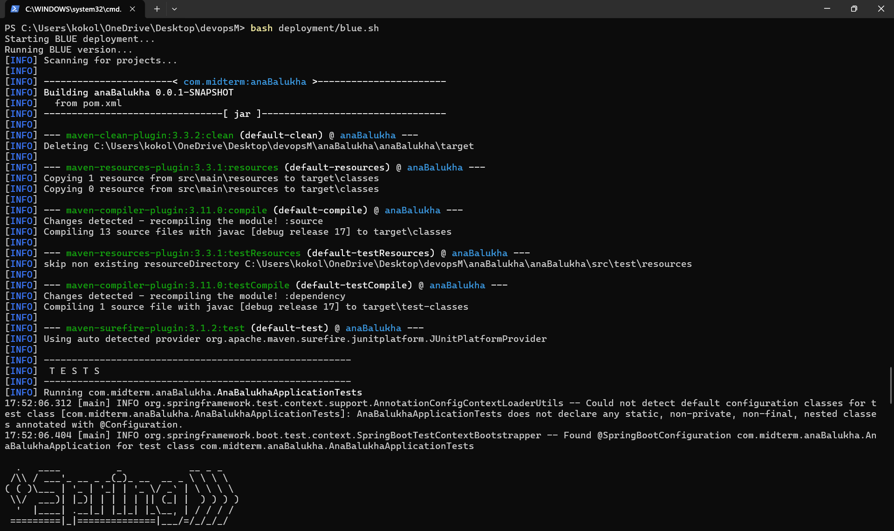
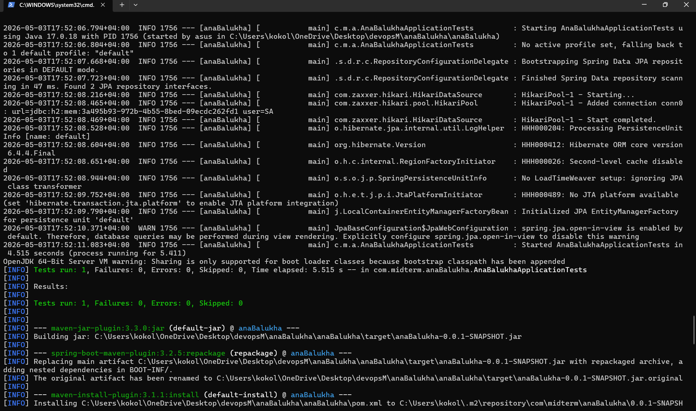
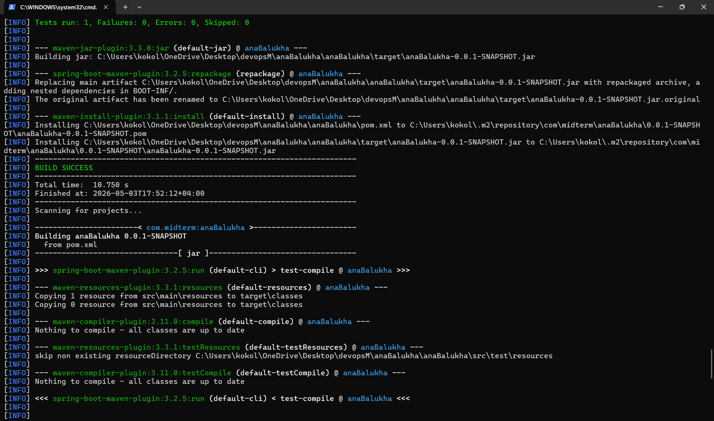
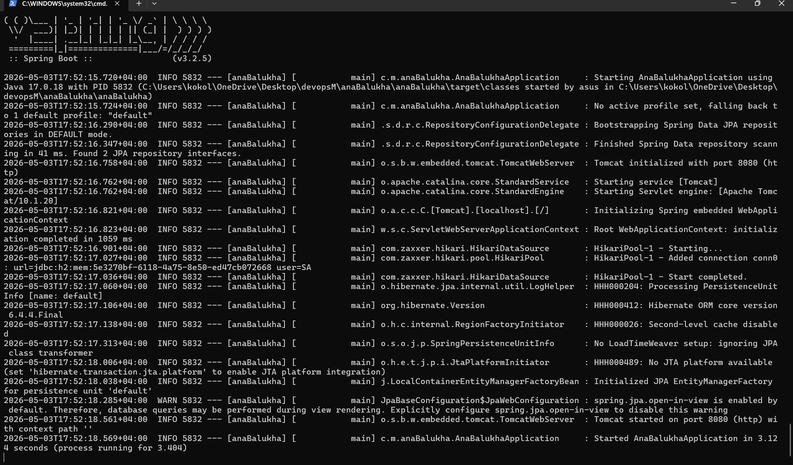
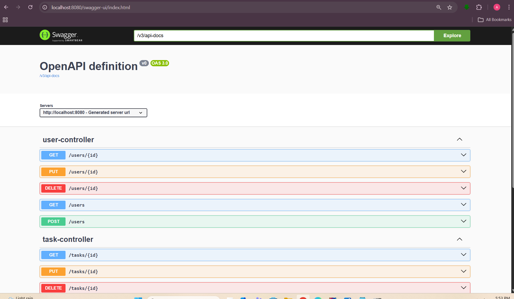
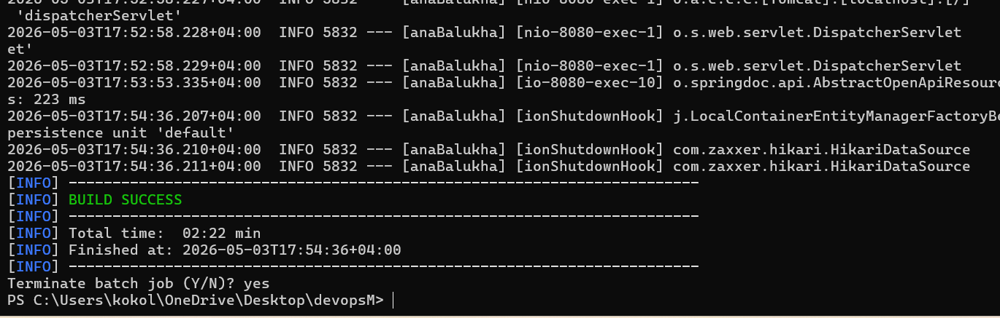

# Monitoring & Health Check

I created a simple monitoring system using a Bash script that checks whether the application is running 
or not. The script sends periodic requests to the application and logs the status into a file, which 
allows tracking whether the application is healthy over time.
The health check results are stored in a log file, which can later be analyzed to understand 
application stability.

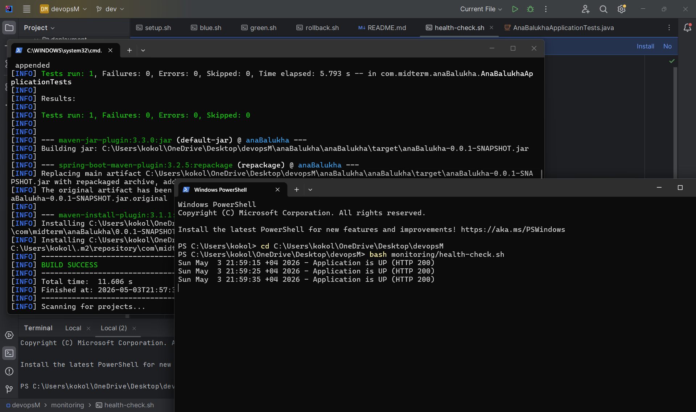

# API Testing (Swagger UI)

Swagger UI was integrated into the project to provide an easy way of testing REST API endpoints. 
Instead of using external tools like Postman, all endpoints can be tested directly 
through a web interface. because Swagger provides: List of all endpoints, Request/response structure and 
Ability to test APIs directly in browser

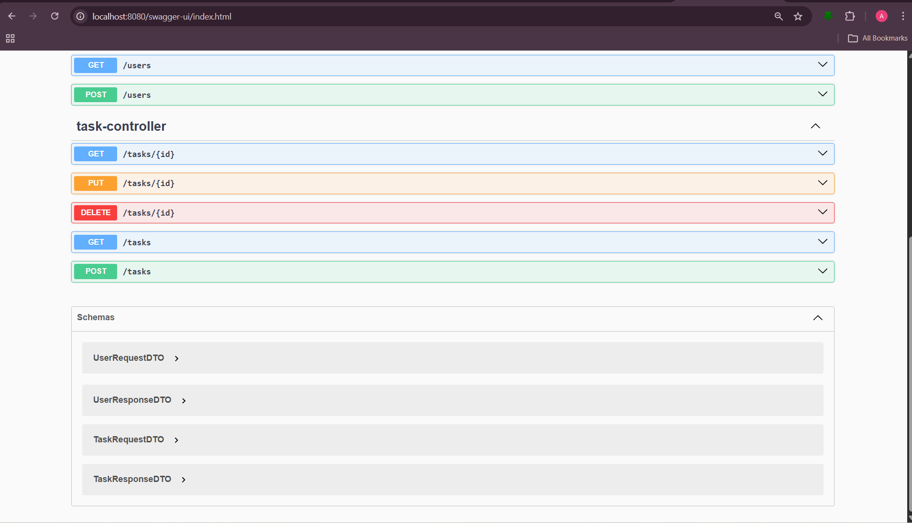 